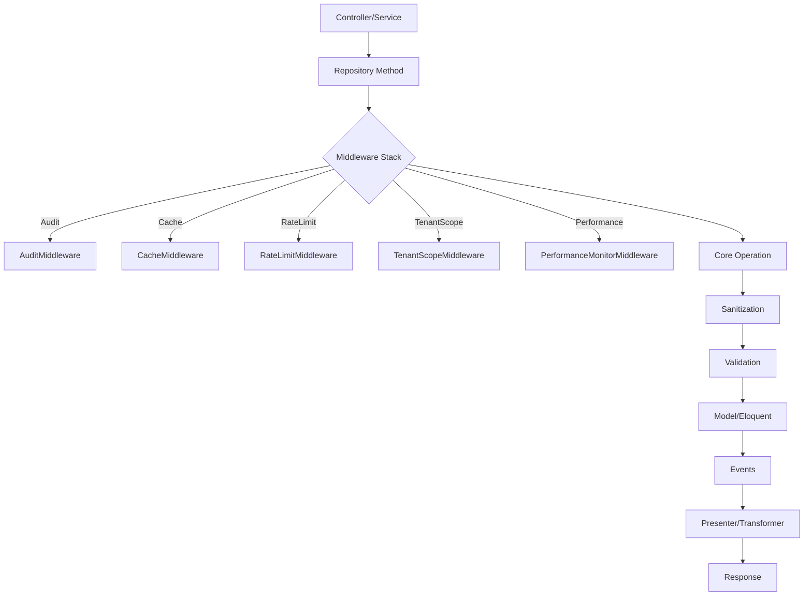
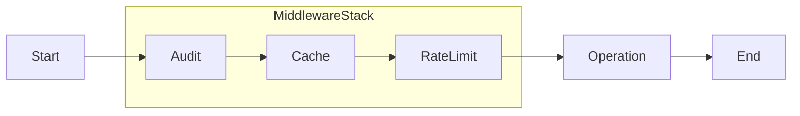
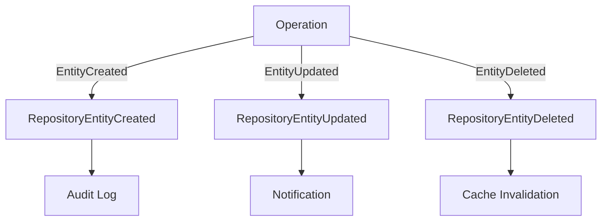
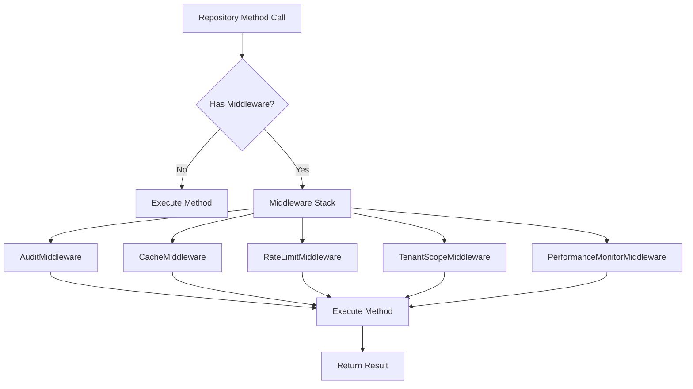

# Architecture & Lifecycle Diagrams

This page provides visual diagrams and flowcharts to help you understand the architecture, repository lifecycle, middleware flow, and event dispatching in Apiato Repository.

---

## 1. Repository Operation Lifecycle



---

## 2. Middleware Flow



---

## 3. Event Dispatching



---

# Architecture Diagrams & Visuals

## 1. Middleware Pipeline



## 2. Event Flow

```mermaid
graph TD;
    A[Repository Operation] --> B[Dispatch Event]
    B --> C[Event Listener(s)]
    C --> D[Handle Side Effects (e.g., Audit, Cache, Notification)]
```

## 3. Transaction Handling

```mermaid
graph TD;
    A[Repository Method] --> B{Transaction Needed?}
    B -- No --> C[Execute Directly]
    B -- Yes --> D[Begin Transaction]
    D --> E[Execute Operation(s)]
    E --> F{Success?}
    F -- Yes --> G[Commit]
    F -- No --> H[Rollback]
    G & H --> I[Return Result]
```

---

For more, see [Feature Matrix](feature-matrix.md) and [API Methods Reference](reference/api-methods.md).

**See also:** [Advanced Features](guides/advanced-features.md), [Middleware Guide](tutorials/middleware.md), [Events Reference](reference/events.md), [Troubleshooting](reference/troubleshooting.md)
